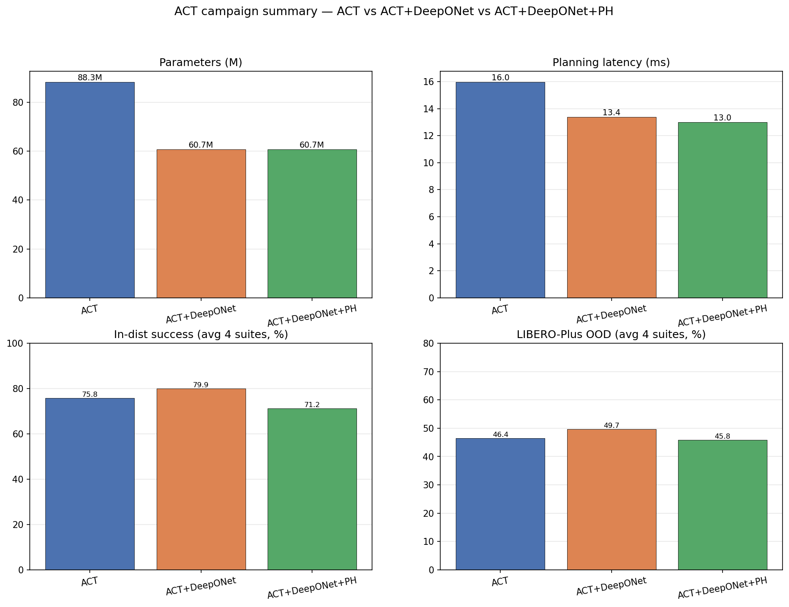

# ACT + DeepONet Operator Action Head (+ Persistent-Homology loss) — LIBERO

This is the **ACT-backbone** companion to the SmolVLA study in the parent repo. It replaces ACT's
**transformer action decoder** with a lightweight **DeepONet operator action head** (optionally
regularised by a **gated Persistent-Homology (PH) topological loss**) and benchmarks all three heads
**in-distribution on the four LIBERO suites** (Spatial / Object / Goal / Long).

> **One-line result (V1 — from-scratch, 30K/suite):** the DeepONet head **wins on every axis on average** —
> higher **in-distribution** (79.9 vs 75.9 %), higher **out-of-distribution robustness** (LIBERO-Plus 49.7 vs
> 46.4 %), **3.7× smaller action head** (37.8 M → 10.2 M; 88.3 M → 60.7 M total), and **~16 % lower planning
> latency** (13.4 vs 16.0 ms). The PH regulariser does **not** help: it lowers in-distribution accuracy on every
> suite and is below the ACT baseline on OOD average (its one win is Long-OOD).

> **Two training regimes.** All numbers above and in the tables below are **V1 = from-scratch, 30K steps per
> suite**. A later **V2 = transfer regime** (40-task pretrain 15K → per-suite finetune 15K) is reported in its
> own section — [V2 transfer results](#v2--transfer-regime-40-task-pretrain--per-suite-finetune) and
> [`act_results_v2/`](act_results_v2/). Under V2 the DeepONet head still wins the whole-suite average
> (in-dist +1.9, robustness +3.3) and wins Spatial/Long, but **Object flips negative (−16.3)** — root-caused to
> transfer under-training, not a bug. V2 is the regime that motivated the pi0.5 / GR00T comparisons in the parent repo.

> **Scope note (updated 2026-06-27):** this repository now contains the **architecture, training/eval code,
> in-distribution results, LIBERO-Plus robustness (OOD) results, measured latency, and all plots**. Model
> **checkpoints** are too large for GitHub and live on Hugging Face — see
> [Checkpoints & full recreatability](#checkpoints--full-recreatability). The third-party LIBERO-Plus
> benchmark install is not vendored (re-clonable; see the same section).

---

## Architecture

```
                              INPUT  (LIBERO observation, fps 10)
  ┌────────────────┬────────────────┬───────────────┬────────────────────────────┐
  │ agentview img  │   wrist img    │  robot state  │   language instruction      │
  │   3×256×256    │   3×256×256    │     8-dim     │  "pick up the black bowl…"  │
  └───────┬────────┴───────┬────────┴───────┬───────┴──────────────┬─────────────┘
          │                │                │                      │
   ┌──────▼────────────────▼──────┐   ┌─────▼──────┐    ┌───────────▼────────────┐
   │     ResNet-18 backbone       │   │ state proj │    │  TinyLanguageEncoder    │
   │     (shared, 11.2 M)         │   │            │    │  BERT tokenizer + 2-layer│
   │       → visual tokens        │   │            │    │  transformer  (~4 M)     │
   └──────────────┬───────────────┘   └─────┬──────┘    └───────────┬─────────────┘
                  └─────────────────┬───────┴───────────────────────┘
                                    │  tokens  (+ CVAE style latent z, 32-d, train-only)
                          ┌─────────▼──────────┐
                          │ Transformer encoder │   4 layers · d_model 512 · ff 3200
                          └─────────┬──────────┘
                                    │  memory  [B, N, 512]
              ┌─────────────────────┴─────────────────────────┐
              │                                                │
     ══ ACT baseline ══                       ══ ACT + DeepONet  (+PH) ══
  ┌────────────────────────┐         ┌────────────────────────────────────────────┐
  │  Transformer decoder   │         │  CrossAttnPool : 8 learned queries,         │
  │  7 layers  (37.8 M)    │         │    Perceiver-style cross-attention × 3 blocks│
  │                        │         │                     │                        │
  │                        │         │            ┌────────┴─────────┐              │
  │                        │         │       Branch b(u)          Trunk φ(τ)        │
  │                        │         │       p = 256 coeffs       Fourier τ, n = 6  │
  │                        │         │            └────────┬─────────┘              │
  │                        │         │      Hadamard  c ⊙ φ  →  out_mlp(·) + bias   │
  │                        │         │            DeepONet head  (10.2 M)           │
  └───────────┬────────────┘         └───────────────────────┬─────────────────────┘
              │                                               │
              ▼                                               ▼
     action chunk [T = 100, 7-DoF]                  action chunk [T = 100, 7-DoF]

  Loss:  L1 (action reconstruction) + KL (CVAE)
         + gated Persistent-Homology loss   (ACT+DeepONet+PH only)
           PH: warm-up 5000 steps · per-sample trigger 0.15 · λ = 0.02 · 0 params (loss-only)

  Params:   ACT 88.3 M   →   ACT+DeepONet 60.7 M      (action head 37.8 M → 10.2 M, 3.7× smaller)
```

**Why a DeepONet head?** A DeepONet (Lu et al., *Nature Machine Intelligence* 2021) approximates an *operator*
`G: u ↦ G(u)(τ)` as a **branch** network (encodes the conditioning `u` into `p` coefficients) times a **trunk**
network (a `τ`-indexed basis). Predicting an action *chunk* (a function over the chunk index `τ`) from the
current observation is exactly an operator-learning problem, so the head produces the whole chunk in a single
forward pass — no autoregression, no diffusion/flow denoising — at a fraction of the decoder's parameters.

**The PH loss** matches the *topological shape* (persistence diagram) of predicted vs ground-truth action
trajectories. It is **gated** (only fires after a warm-up and on samples above an error trigger) and adds **no
parameters**. In this study it did not improve in-distribution accuracy.

---

## In-distribution results (LIBERO, success rate %)

Each number is mean success over the suite's 10 tasks (re-evaluation run, replan 5). Higher is better.

| Suite | ACT (baseline) | ACT + DeepONet | ACT + DeepONet + PH |
|---|---|---|---|
| LIBERO-Spatial | 83.7 | 83.7 | 78.0 |
| LIBERO-Object | 81.7 | **87.0** | 72.0 |
| LIBERO-Long (LIBERO-10) | 54.7 | **62.7** | 50.0 |
| LIBERO-Goal | 83.3 | **86.3** | 85.0 |
| **Average** | 75.9 | **79.9** | 71.3 |

- **ACT + DeepONet ≥ ACT baseline in-distribution on all four suites** (tie on Spatial), at a **3.7× smaller
  action head** and ~31% fewer total parameters.
- **PH does not help in-distribution** — it lowers accuracy on every suite; the bare operator head is the one to use.

---

## Out-of-distribution robustness — LIBERO-Plus (success rate %)

Each model evaluated on the **7 LIBERO-Plus perturbation categories** (12 tasks/category, replan 5, LeRobot
relative-action env). `robustness_average` is the mean over the 7 categories. Canonical run:
`act_results/<Suite>/runs/eval_lerobot_full/robustness_plus.json`. Higher is better.

| Suite | ACT (baseline) | ACT + DeepONet | ACT + DeepONet + PH |
|---|---|---|---|
| LIBERO-Spatial | 61.9 | **65.5** | 57.1 |
| LIBERO-Object | 46.4 | **53.6** | 47.6 |
| LIBERO-Long | 22.6 | 20.2 | **27.4** |
| LIBERO-Goal | 54.8 | **59.5** | 51.2 |
| **Average** | 46.4 | **49.7** | 45.8 |

**Per-perturbation, averaged over the four suites:**

| Perturbation | ACT | ACT + DeepONet | ACT + DeepONet + PH |
|---|---|---|---|
| Camera Viewpoints | 41.7 | **45.8** | **45.8** |
| Light Conditions | **66.7** | 64.6 | 56.2 |
| Sensor Noise | 39.6 | 45.8 | **47.9** |
| Background Textures | 54.2 | **56.3** | 43.8 |
| Objects Layout | 43.8 | **50.0** | 41.7 |
| Robot Initial States | 14.6 | 16.7 | **22.9** |
| Language Instructions | 64.6 | **68.8** | 62.5 |

- **DeepONet is the most robust on average** (49.7 vs 46.4), winning 3/4 suites and 4/7 perturbation categories.
- **Robot Initial States is the universal weak spot** (~15–23 % for all variants); **Long** collapses for everyone
  on Camera/Sensor Noise.
- **PH's only win is Long-OOD** (27.4) — otherwise it trails the ACT baseline.

> **Note on the eval harness:** earlier LIBERO-Plus numbers were corrupted by two harness bugs (a skipped
> physics-settle step and a wrong action space) that made DeepONet-Object read ~0 %. Both are fixed in the
> LeRobot relative-action env used by `evaluate_plus_lerobot.py`; `eval_lerobot_full` is the canonical set.

---

## V2 — transfer regime (40-task pretrain → per-suite finetune)

The **V2** regime replaces from-scratch 30K training with a **40-task multi-suite pretrain (15K)** followed by a
per-suite **finetune (15K)**. Eval is byte-identical to V1 (`evaluate_act.py`, 10 tasks × 3 seeds, replan=5,
max_steps 520, last checkpoint, EMA 0.999). Numbers parsed from `act_results_v2/eval_v2_15k.log`
(`act_results_v2/summary_v2_15k.csv`); details in [`act_results_v2/README.md`](act_results_v2/README.md).

| Suite | ACT baseline in-dist / **Plus** | ACT+DeepONet in-dist / **Plus** | +PH in-dist / **Plus** | DeepONet − base (in-dist) |
|---|---|---|---|---|
| LIBERO-Spatial | 81.0 / 58.3 | **85.3 / 66.7** | 76.7 / 57.1 | **+4.3** ✅ |
| LIBERO-Object | 81.3 / 45.2 | 65.0 / 45.2 | 70.7 / 38.1 | **−16.3** ❌ |
| LIBERO-Long | 45.3 / 19.0 | **66.3 / 20.2** | 44.3 / 23.8 | **+21.0** ✅ |
| LIBERO-Goal | 86.0 / 50.0 | 84.7 / 53.6 | 74.0 / 50.0 | −1.3 (tie) |
| **Average** | 73.4 / 43.1 | **75.3 / 46.4** | 66.4 / 44.8 | **+1.9 / +3.3** |

- Under V2 the DeepONet head **still wins the whole-suite average** (in-dist +1.9, robustness +3.3) and wins
  **Spatial (+4.3)** and **Long (+21.0)**.
- **Object flips negative (−16.3)** — the opposite of V1's +5.3. Root cause: **transfer under-training**, not an
  eval/harness bug (eval is byte-identical V1↔V2; only the budget differs — V1=30K from-scratch, V2=15K pretrain→15K
  finetune). 8K→15K the operator rises +0.67 pp while the baseline drops, and collapsed Object tasks recover
  (salad-dressing 10→43 %, orange-juice 17→33 %). It is Object-specific.
- **PH again does not help** (lower in-dist on 3/4 suites).
- **V2 checkpoints** are on HF `AyushShah1107/act-deeponet-libero-checkpoints` under `v2/` (see
  `act_results_v2/backup_v2_to_hf.py`); pruned locally.

**Why V2 matters:** it is the head-only-style transfer regime that the pi0.5 (comp-1) and GR00T (comp-2) studies in
the parent repo scale up. The takeaway is consistent — the operator head helps when the representation can adapt
(ACT trains end-to-end; SmolVLA unfreezes stage-2), and struggles most where budget/adaptation is limited.

---

## Latency & efficiency (measured on this machine)

Forward-pass latency on **NVIDIA RTX PRO 6000 Blackwell**, bf16, batch 1 (`bench_latency.py` → `act_results/latency.json`).
"Planning" = one full action-chunk forward; "amortized" = per control step under receding-horizon replan = 5.

| Variant | Total params | Action head | Planning latency | Amortized / step (replan 5) | Control freq |
|---|---|---|---|---|---|
| ACT (baseline) | 88.3 M | 37.8 M | 16.0 ms | 3.90 ms | ~257 Hz |
| **ACT + DeepONet** | **60.7 M** | **10.2 M** | **13.4 ms** | **3.23 ms** | **~310 Hz** |
| ACT + DeepONet + PH | 60.7 M | 10.2 M | 13.0 ms | 3.35 ms | ~298 Hz |

PH is loss-only (0 added params), so it is latency-identical to DeepONet within noise.

---

## Plots

All figures (parameters, latency, in-dist, per-task, LIBERO-Plus overall + all 7 perturbations, heatmaps, radar,
efficiency Pareto, master summary) are in [`act_results/plots_all/`](act_results/plots_all/) with a
[README index](act_results/plots_all/README.md) and `summary.csv` / `summary.json`. Regenerate with
`python make_plots.py` (latency via `python bench_latency.py`).



---

## Components & files

| File | What it is |
|---|---|
| [`deeponet_head_v2.py`](deeponet_head_v2.py) | DeepONet head: CrossAttnPool → branch ⊗ trunk (Hadamard) → out_mlp |
| [`modeling_act_deeponet.py`](modeling_act_deeponet.py) | ACT policy with the decoder swapped for the DeepONet head + language token |
| [`ph_loss_gated.py`](ph_loss_gated.py) / [`ph_loss.py`](ph_loss.py) | gated persistent-homology topological loss |
| [`lang_encoder.py`](lang_encoder.py) | `TinyLanguageEncoder` (BERT tokenizer + 2-layer transformer, ~4 M) |
| [`train_act.py`](train_act.py) | training (30K steps, batch 64, EMA, RAM-cached dataloader, optional augmentation) |
| [`evaluate_act.py`](evaluate_act.py) | closed-loop in-distribution evaluation on LIBERO |
| [`ram_cache.py`](ram_cache.py) | decode-once RAM cache (eliminates per-epoch image re-decode) |
| [`act_common.py`](act_common.py) | policy builder / checkpoint I/O |
| [`evaluate_plus_act.py`](evaluate_plus_act.py) | LIBERO-Plus robustness eval (original robosuite harness) |
| [`evaluate_plus_lerobot.py`](evaluate_plus_lerobot.py) | LIBERO-Plus eval on the LeRobot relative-action env (**canonical**, fixes the settle/action-space bugs) |
| [`bench_latency.py`](bench_latency.py) | forward-pass latency microbenchmark → `act_results/latency.json` |
| [`make_plots.py`](make_plots.py) | regenerates every figure in `act_results/plots_all/` |
| [`architecture.md`](architecture.md) | full architecture write-up (tensor shapes, param budget) |
| `run_act_campaign.sh` | the full 4-suite × 3-variant campaign |

Results live under [`act_results/<Suite>/runs/`](act_results/): per-variant training logs, in-distribution
`eval_rerun_indist/success_rates.json`, LIBERO-Plus `eval_lerobot_full/robustness_plus.json`, per-task plots, and
rollout videos. Model checkpoints are **not** committed (too large for GitHub) — they are on Hugging Face (below).

---

## Checkpoints & full recreatability

GitHub holds all code, results, plots, logs, and videos. The large **model checkpoints** live on Hugging Face, so
the whole study is recoverable from the two together.

**Checkpoints (Hugging Face):** [`AyushShah1107/act-deeponet-libero-checkpoints`](https://huggingface.co/AyushShah1107/act-deeponet-libero-checkpoints)
- Main campaign: `<Suite>/<variant>/<step>/model.safetensors` (4 suites × {act, act_deeponet, act_deeponet_ph} × steps 5K–30K).
- Side experiments: `extra/act_results_aug/…` (abandoned augmentation runs) and `extra/act_results_gripfix/…`
  (Object DeepONet grip-fix ablation, 96 % in-dist).

**To recreate the folder from scratch:**
```bash
git clone https://github.com/AyushShah1107/DeepOnet-PH-VLA.git "Ayush PH test" && cd "Ayush PH test"
python -m venv venv && source venv/bin/activate && pip install -r requirements.txt   # rebuild env (venv/ not pushed)
# benchmark deps (third_party/ not pushed — re-clone at the pinned commits):
git clone https://github.com/sylvestf/LIBERO-plus.git third_party/LIBERO-plus && git -C third_party/LIBERO-plus checkout 4976dc3
git clone https://github.com/Lifelong-Robot-Learning/LIBERO.git third_party/LIBERO && git -C third_party/LIBERO checkout 8f1084e
# pull checkpoints back to their local paths:
hf download AyushShah1107/act-deeponet-libero-checkpoints --local-dir /tmp/ckpts
# place /tmp/ckpts/<Suite>/<variant>/<step>/ under ACT/act_results/<Suite>/runs/<variant>/checkpoints/<step>/
```

---

## Reproduce

```bash
source ../venv/bin/activate
export MUJOCO_GL=egl
# train one variant on one suite
python train_act.py --variant act_deeponet --dataset lerobot/libero_object_image \
  --out act_results/Object/runs/act_deeponet --steps 30000 --batch 64 --ckpt_every 5000
# in-distribution evaluation (3 seeds)
python evaluate_act.py --model act_deeponet=act_results/Object/runs/act_deeponet/checkpoints/LATEST \
  --suite libero_object --dataset lerobot/libero_object_image --out act_results/Object/runs/eval_indist \
  --indist_episodes 10 --test_seeds 3 --replan 5 --only indist --max_steps 520
```

Variants: `act` (baseline) · `act_deeponet` (operator head) · `act_deeponet_ph` (operator head + PH loss).

---

## Honest notes
- Numbers above are **in-distribution** behavioral-cloning success rates (20 ep/task on the re-eval; 10 ep × 3
  seeds protocol available via `evaluate_act.py`). High in-distribution success does not by itself prove robustness.
- The DeepONet head's defensible in-distribution claim is **parity at lower cost**, not a clear accuracy win.
- **PH is not recommended** (no in-distribution benefit here).
